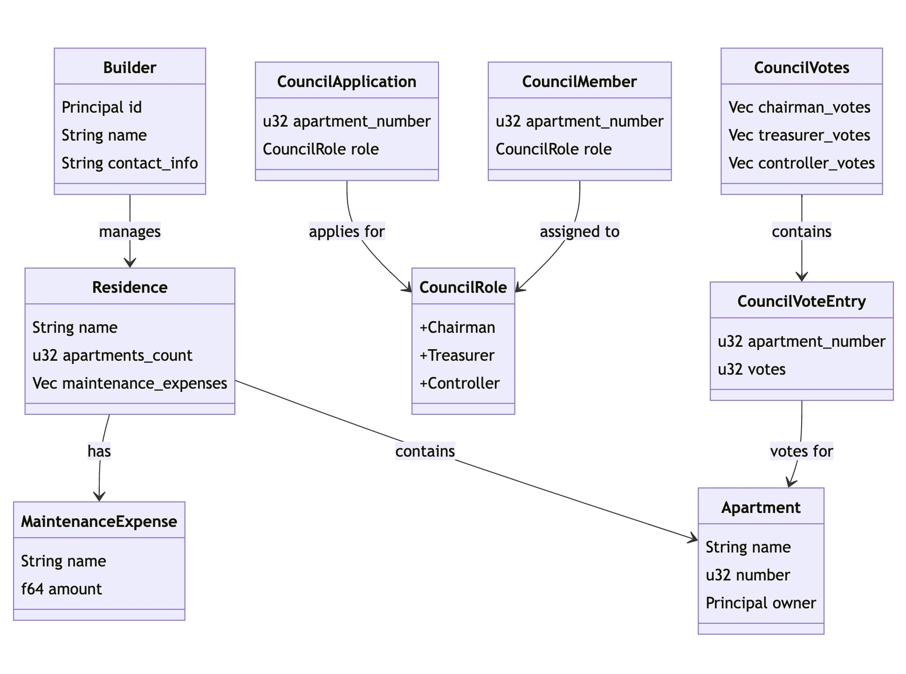
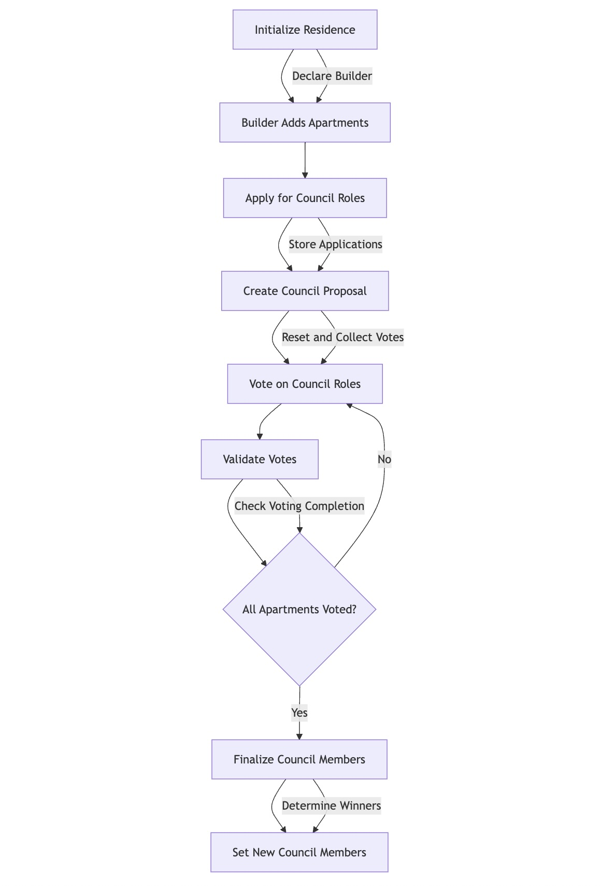

# Residence DAO

A DAO for managing a housing cooperative or residential building. This project is built using Rust and the Internet Computer platform, enabling efficient decision-making and proposal handling within a community of apartment owners.

## Links

- [Requirements](#requirements)
- [Running the Project Locally](#running-the-project-locally)
- [Commands and Examples](#commands-and-examples)
- [Overview](#overview)
  - [Class Diagram](#class-diagram)
  - [Workflow](#workflow)

## Requirements

To run this project locally, ensure you have the following tools installed:

1. **DFX CLI (0.19.0 or higher)**
   - The DFX CLI is required to create, deploy, and manage canisters on the Internet Computer.
   - [Installing DFX](https://internetcomputer.org/docs/current/developer-docs/getting-started/install/)
   
2. **Rust (rustc 1.80.1 or higher)**
   - Install Rust and Cargo using the official Rust toolchain installer:
     ```bash
     curl --proto '=https' --tlsv1.2 -sSf https://sh.rustup.rs | sh
     ```
   
3. **WebAssembly Target (wasm32-unknown-unknown)**
   - Add the WebAssembly target to your Rust toolchain to compile Rust code to WebAssembly:
     ```bash
     rustup target add wasm32-unknown-unknown
     ```
   
4. **Candid Extractor**
   - Install the Candid extractor to generate Candid definitions from WebAssembly modules:
     ```bash
     cargo install candid-extractor
     ```

## Running the Project Locally

Follow these steps to start the project on your local environment:

1. **Start the Internet Computer Replica:**
```bash
   dfx start
```
2. **Generate&Deploy the Canister:**
```
  npm run gen-deploy
```

## Commands and Examples

This section provides the essential commands required to operate the DAO for residence management, from the initial deployment to finalizing council members.

### 1. Initial Deployment

When deploying the DAO contract, you need to set up the residence with the following parameters:

*Parameters:*
- **Residence Name:** The name of the residence.
- **Apartments Count:** The total number of apartments in the residence.
- **Builder Identifier:** The Principal ID of the builder.
- **Expenses:** A list of maintenance expenses.

### 2. Adding Apartments

The builder must add each apartment by calling the `add_apartment` function. This should be done for each apartment, corresponding to the number of apartments defined during the deployment.

**Command:**
`dfx canister call core add_apartment`

*Parameters:*
- **Apartment Number:** A unique number for each apartment.
- **Apartment Name:** The name of the apartment.
- **Owner Identifier:** The Principal ID of the apartment's owner.

### 3. Apply for Council Roles

Apartment owners can apply for council roles using the `apply_for_council` function. Each Principal can apply for only one role to maintain decentralization and security.

**Command:**
`dfx canister call core apply_for_council`

*Parameters:*
- **Apartment Number:** The number of the apartment applying for the role.
- **Council Role:** The role being applied for (Chairman, Treasurer, or Controller).

### 4. Create Council Proposal

After receiving applications, trigger the `make_council_proposal` function to reset any previous votes and prepare the voting process.

**Command:**
`dfx canister call core make_council_proposal`

### 5. Voting on Council Roles

Each apartment owner must vote for every council role. Use the `vote_for_council` function, and refer to `get_council_applications` to review the available applications.

**Command:**
`dfx canister call core vote_for_council`

*Parameters:*
- **Voter Apartment Number:** The number of the apartment casting the vote.
- **Target Apartment Number:** The number of the apartment being voted for.
- **Council Role:** The council role for which the vote is being cast.

### 6. Finalizing the Council

Once all apartments have voted, call the `finalize_council` function to finalize the council members based on the voting results.

### 7. Retrieve Council Members

After finalization, retrieve the list of new council members using the `get_council_members` function.

## Overview

### Class Diagram
The following diagram provides an overview of the main classes and their relationships within the project:



### Workflow
The following flowchart provides a step-by-step process of the main activities and interactions within the DAO:

